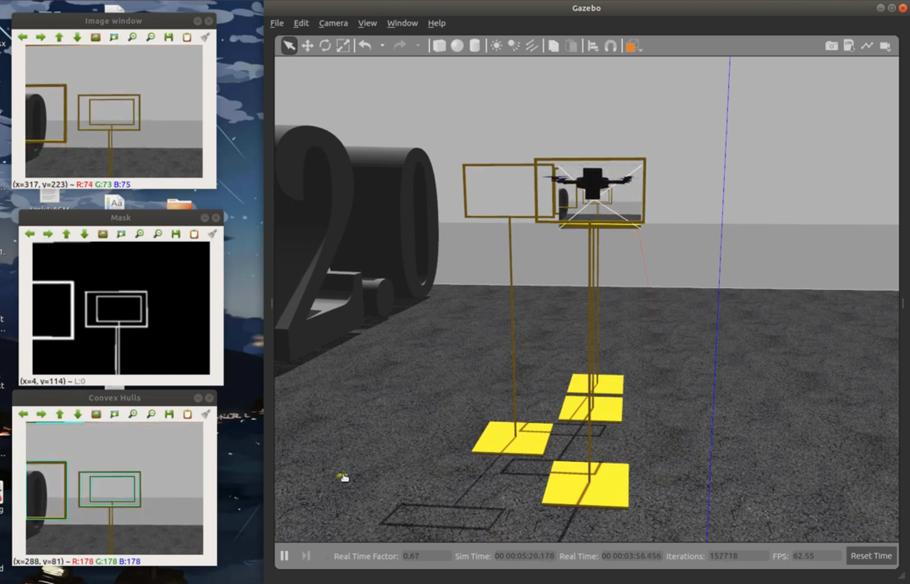

# Autonomous-Indoor-Drone
This repository aims at building a low cost drone which is capable of lifting 1kg package and pass through wireframes while avoiding obstacles. This for created as part of competition conducted by Flipkart. Main idea was based on depth camera and normal RGB camera, stereo was also tested. Depth camera to avoid obstacles and RGB camera to get location of wireframe with help of VIO. This still requires a development and it's not yet complete.

**Instructions to set up avoidance module with stereo camera**

1.) Set up local planner and px4 firmware as mentioned at https://github.com/PX4/PX4-Avoidance#run-the-avoidance-gazebosimulation 

2.) Copy Paste following files to location of firmware -

* `10031_aeroBITS`, `10034_aeroBITS_stereo_camera` from `Simulator/config/` to `Firmware/ROMFS/px4fmu_common/init.d-posix/`

* `aeroBITS`, `aeroBITS_stereo_camera` from `Simulator/models/aeroBITS` to `Firmware/Tools/sitl_gazebo/models/`

* Copy `meshes/aeroBITS_without_legs-stl.stl` to `Firmware/Tools/sitl_gazebo/models/rotors_description/meshes`

Run -  `roslaunch px4 posix_sitl.launch vehicle:=aeroBITS_stereo_camera`

This should launch aeroBITS model with stereo model in empty gazebo world.

3.) Change the value of argument `model` in launch file of avoidance package to `aeroBITS_stereo_camera` from `iris_stereo_camera`

4.) Following commands should launch local_planner and global_plannerrespectively

`roslaunch local_planner local_planner_stereo.launch`

`roslaunch global_planner global_planner_stereo.launch`

**Instructions to test world with Gates**

1.) Copy Following items to firmware as mentioned -
* `10031_aeroBITS`, `10032_aeroBITS_stereo_camera` from `Simulator/config/` -> `Firmware/ROMFS/px4fmu_common/init.d-posix/`

*  `aeroBITS`, `aeroBITS_sensors` from `Simulator/models/aeroBITS` to `Firmware/Tools/sitl_gazebo/models/`

* `meshes/aeroBITS_without_legs-stl.stl` to `Firmware/Tools/sitl_gazebo/models/rotors_description/meshes` 

* `launch/aeroBITS.launch` to `firmware/launch`

* `worlds/4_gates_3.world` to `firmware/Tools/sitl_gazebo/worlds/`

Run `roslaunch px4 posix_sitl.launch vehicle:=aeroBITS_sensors`

This should launch aeroBITS model with FPV camera in empty gazebo world.

2.) Now, go to `Simulator/scripts` and run 

`python gate_detection.py`

Three windows will open which detects gate

3.) Put aerobits folder in src of ROS workspace,
default `catkin_ws/src` and build aerobits package

`catkin build aerobits`

Then finally simulation can be run,

`roslaunch px4 aeroBITS.launch`

`rosrun aerobits offboard`

**Instructions for setting up obstacle avoidance with depth camera and HKUST fast planner**

1.) Setup px4_fast_planner as mentioned at - https://github.com/mzahana/px4_fast_planner

2.) Copy Following items as mentioned -

* `aeroBITS`, `aeroBITS_depth_camera_new` and `depth camera` from models and paste it in `Firmware/Tools/sitl_gazebo/models/`

* Copy `10031_aeroBITS`, `10035_aeroBITS_depth_camera_new` from `Simulator/config/` to `Firmware/ROMFS/px4fmu_common/init.d-posix/`

Now run -
`roslaunch px4 posix_sitl.launch vehicle:=aeroBITS_depth_camera_new`

This should launch a aeroBITS model with depth camera in empty gazebo world.

3.) Following needs to be copied to run final simulation -

* `grid3.world` from `Simulator/worlds/` to `firmware/Tools/sitl_gazebo/worlds/` 

* `simulator/launch/aeroBITS_depth_camera.launch` and `mavros_updated.launch` to launch of px4_fast_planner package i.e., in my case `catkin_ws/src/px4_fast_planner/launch/`

* `simulator/meshes/grid.stl` to `Firmware/Tools/sitl_gazebo/models/rotors_description/meshes` 

Run,

`roslaunch px4_fast_planner aeroBITS_depth_camera.launch`

Publishing message to goal will set target for the drone and it will try to reach that target while avoiding obstacles. Open a new terminal and enter following command to test - 

`rostopic pub /move_base_simple/goal geometry_msgs/PoseStamped '{header: {stamp: now, frame_id: "map"}, pose: {position: {x: 10.0, y: 10.0, z: 1.0}, orientation: {w: 1.0}}}'`

<!-- 1.) Setup px4-Firmware

2.) Copy-Paste following files to your Firmware

a) 10017_aeroBITS, 31 Three files in this category
 Simulator/config/10017_aesroBITS -> Firmware/ROMFS/px4fmu_common/init.d-posix/

b) Simulator/launch/aeroBITS.launch -> Firmware/launch/

c) are all model there 
Simulator/models/aeroBITS and Simulaor/models/aeroBITS_sensors/aeroBITS_sensors -> Firmware/Tools/sitl_gazebo/models/

d) Simulator/worlds/flipkart.world and Simulator/worlds/flipkart_lite.world -> Firmware/Tools/sitl_gazebo/worlds/

e) Simulator/models/meshes/aeroBITS.stl -> Firmware/Tools/sitl_gazebo/models/rotors_description/meshes/ -->

<!-- **To quickly test model**

a) `roslaunch px4 posix_sitl.launch vehicle:=aeroBITS`

Team custom droneshould be visible in gazebo custom world. You may hover it around using QgroundControl

b) If `GAZEBO_MODEL_PATH` is correctly setup than you may launch it, and try drag and drop that model -->

<!-- **To launch model into Flipkart World**

a) `roslaunch px4 aeroBITS.launch` -->

**QGroundControl**

Drone in simulation for all cases can also be controlled with QGroundControl, also we can have direct fpv camera feed from drone in QgroundControl. Settings for the same is mentioned here - 

1.) Click on Q icon in QGroundControl

2.) Select general in application setting

    a) Video source - UDP h.264 Video Stream
    b) UDP port 5600
    c) Aspect Ratio 1.777777

3.) Select Autodelete files if space issues 

**Notes**

1.) If launching local planner does not launch gazebo window check if in avoidance/avoidance_sitl_mavros.launch 'gui' is argument is set to true.

**To Do -**

1.) More detailed instructions on setting up Firmware

2.) Change names of stl file

3.) Instructions to launch world with more than 3 gates

4.) Update Camera position on drone- some issues

5.) Make readme clean

6.) Scripts instructions

7.) Script for automating copy pasting

8.) Improving code for navigation through gates

9.) Switching between fast planner to avoid collisions

10.) Adding simulations for static and aerodynamic analysis of drone

11.) Hardware and inclusion of VIO properly

<!-- Imp Notes -
gui == true , catkin one is with depth camera, rotors description -->

<!-- What all is there,
1.) Creation of own model and world
2.) Fast Planner setting
3.) Obstacle Avoidance complete, local planner global planner
4.) Gate detection and crossing setup
5.) Qgroundcontrol -->

**References**

* **[px4-fast-planner](https://github.com/mzahana/px4_fast_planner)**

* **[Obstacle Detection and Avoidance](https://github.com/PX4/PX4-Avoidance)**

